# COLOR_CONVERSIONS_OF-IMAGE
## AIM
To write a python program using OpenCV to do the following image manipulations.

i) Read, display, and write an image.

ii) Access the rows and columns in an image.

iii) Cut and paste a small portion of the image.

iv)To perform the color conversion between RGB, BGR, HSV, and YCbCr color models.


## Software Required:
Anaconda - Python 3.7
## Algorithm:
### Step1:
Choose an image and save it as a filename.jpg ,
### Step2:
Use imread(filename, flags) to read the file.
### Step3:
Use imshow(window_name, image) to display the image.
### Step4:
Use imwrite(filename, image) to write the image.
### Step5:
End the program and close the output image windows.
### Step6:
Convert BGR and RGB to HSV and GRAY
### Step7:
Convert HSV to RGB and BGR
### Step8:
Convert RGB and BGR to YCrCb
### Step9:
Split and Merge RGB Image
### Step10:
Split and merge HSV Image

##### Program:
```
import cv2

image = cv2.imread('g.png')

cv2.imshow('Original Image', image)
cv2.waitKey(0)
cv2.destroyAllWindows()

cv2.imwrite('original_image.jpg', image)


height, width, channels = image.shape
print("Image Height:", height)
print("Image Width:", width)
print("Number of Channels:", channels)

row = 100
col = 150
pixel_value = image[row, col]
print("Pixel value at row", row, "and column", col, ":", pixel_value)

channel_value = image[row, col, 0]  # Assuming the image is in BGR format
print("Blue channel value at row", row, "and column", col, ":", channel_value)

row_index = 200
selected_row = image[row_index, :]
print("Selected Row:", selected_row)

col_index = 300
selected_col = image[:, col_index]
print("Selected Column:", selected_col)

start_row, start_col = 100, 100
end_row, end_col = 300, 300

cut_region = image[start_row:end_row, start_col:end_col]

paste_row, paste_col = 400, 400
image[paste_row:paste_row+cut_region.shape[0], paste_col:paste_col+cut_region.shape[1]] = cut_region

cv2.imshow('Modified Image', image)
cv2.waitKey(0)
cv2.destroyAllWindows()

cv2.imwrite('modified_image.jpg', image)

import cv2
img = cv2.imread('g.png')
hsv_img = cv2.cvtColor(img, cv2.COLOR_BGR2HSV)
gray_img = cv2.cvtColor(img, cv2.COLOR_BGR2GRAY)
cv2.imshow('Original Image', img)
cv2.imshow('HSV Image', hsv_img)
cv2.imshow('Grayscale Image', gray_img)
cv2.waitKey(0)
cv2.destroyAllWindows()

import cv2
img = cv2.imread('g.png')
hsv_img = cv2.cvtColor(img, cv2.COLOR_BGR2HSV)
rgb_img = cv2.cvtColor(hsv_img, cv2.COLOR_HSV2RGB)
bgr_img = cv2.cvtColor(hsv_img, cv2.COLOR_HSV2BGR)
cv2.imshow('HSV Image', hsv_img)
cv2.imshow('RGB Image', rgb_img)
cv2.imshow('BGR Image', bgr_img)
cv2.waitKey(0)
cv2.destroyAllWindows()

import cv2
img = cv2.imread('g.png')
ycrcb_img = cv2.cvtColor(img, cv2.COLOR_BGR2YCrCb)
cv2.imshow('Original Image', img)
cv2.imshow('YCrCb Image', ycrcb_img)
cv2.waitKey(0)
cv2.destroyAllWindows()

import cv2
img = cv2.imread('g.png')
b, g, r = cv2.split(img)
merged_img = cv2.merge((b, g, r))
cv2.imshow('Original Image', img)
cv2.imshow('Merged Image', merged_img)
cv2.waitKey(0)
cv2.destroyAllWindows()

import cv2
img = cv2.imread('g.png')
hsv_img = cv2.cvtColor(img, cv2.COLOR_BGR2HSV)
h, s, v = cv2.split(hsv_img)
merged_hsv_img = cv2.merge((h, s, v))
merged_bgr_img = cv2.cvtColor(merged_hsv_img, cv2.COLOR_HSV2BGR)
cv2.imshow('Original Image', img)
cv2.imshow('Merged HSV Image', merged_bgr_img)
cv2.waitKey(0)
cv2.destroyAllWindows()

```
### Developed By:MADHAN BABU P
### Register Number: 212222230075


## Output:

### i) Read and display the image

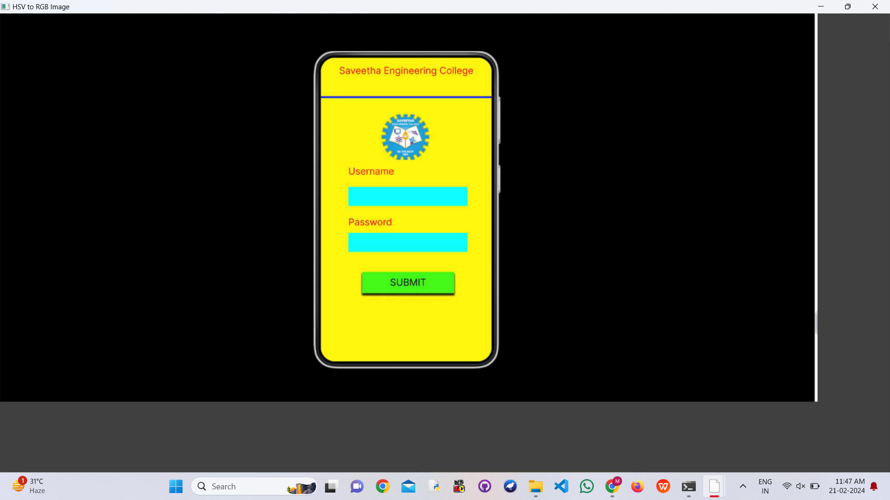


### ii)Write the image

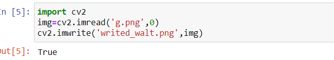


### iii)Shape of the Image

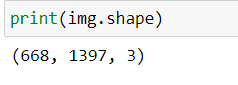


### iv)Access rows and columns
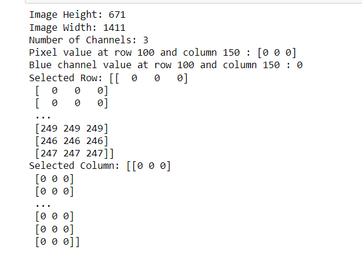


### v)Cut and paste portion of image
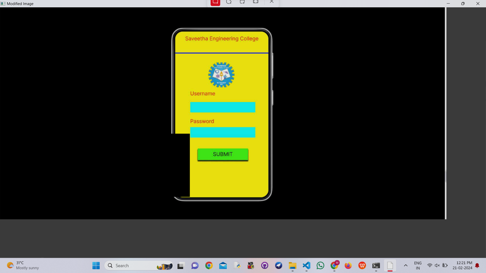


### vi) BGR and RGB to HSV and GRAY
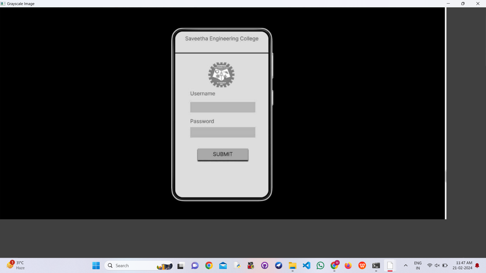
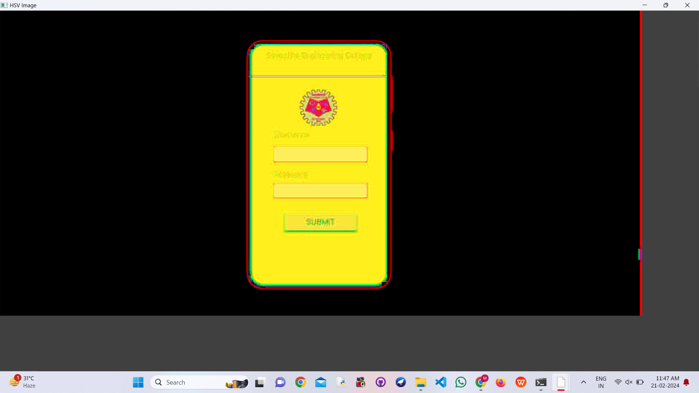


### vii) HSV to RGB and BGR
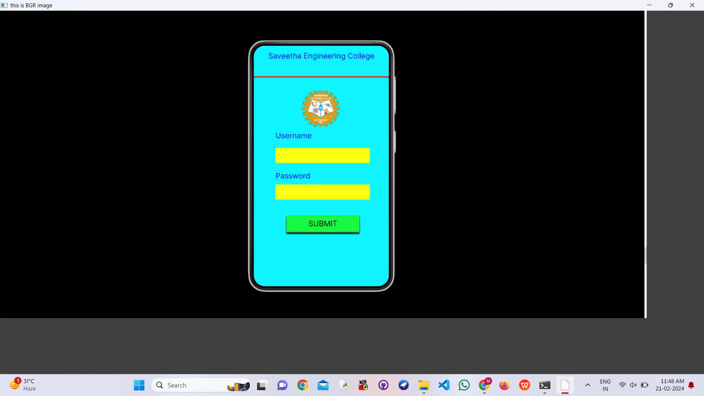
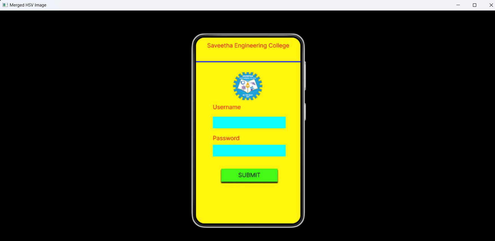


### viii) RGB and BGR to YCrCb

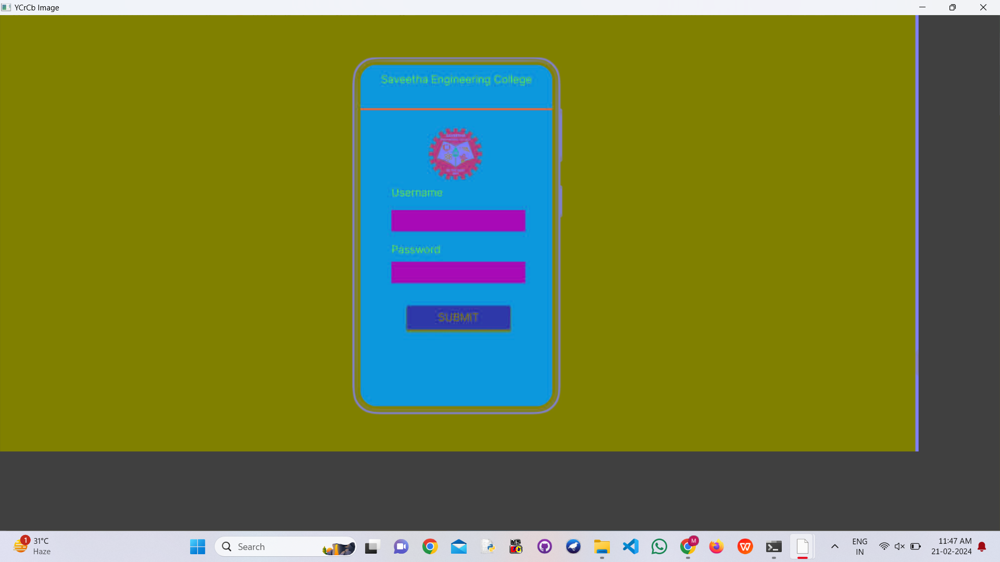


### ix) Split and merge RGB Image


### x) Split and merge HSV Image
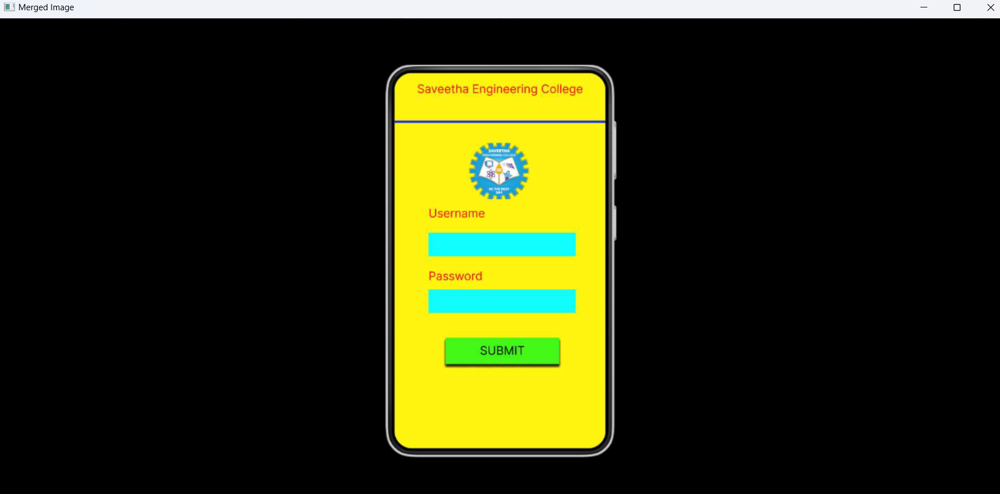


## Result:
Thus the images are read, displayed, and written ,and color conversion was performed between RGB, HSV and YCbCr color models successfully using the python program.


